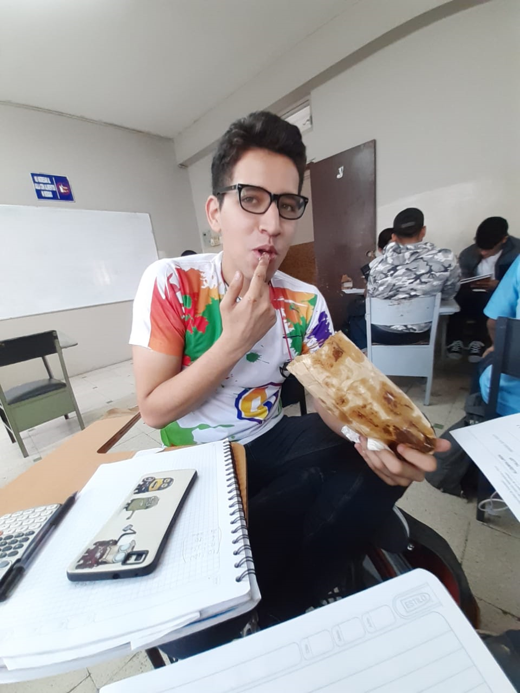

# biografia   				
<html lang="en">
<head>
	<!-- Required meta tags -->
	<meta charset="utf-8">
	<meta name="viewport" content="width=device-width, initial-scale=1, shrink-to-fit=no">
	<!-- ************FAVICON************ -->
	<link rel="icon"   href="img/favicon.png" type="image/png">
	<!-- ************Estilo css Propio************ -->
	<link rel="stylesheet" type="text/css" href="css/estilo.css">
	<!-- Bootstrap CSS -->
	<link rel="stylesheet" type="text/css" href="css/bootstrap.min.css">
	<link rel="stylesheet" href="css/bootstrap.min.css">

	<!-- Estilo INTERNO -->
	
	<title>Personal-Sanchez</title>
	
</head>
<body background="/assets/portfolio.png" style="background-color: #226984;">

     
	

		

			

		

		

			
<h2>2.1)¿Quién soy yo? Autobiografía</h2>

		

		

			

				
Nací en la ciudad de Guayaquil el 13 de mayo del 2000, soy el hijo menor de Mercedes Naranjo y Manolo Ochoa, mis dos padres originarios de Guayaquil, he vivido toda mi vida en la misma casa, estudie la primaria en diferentes escuelas, pero al final regrese en último año, a la primera en la que estuve y estudie kínder, todo esto fue por problemas que no tenía nada que ver con la educación, más por el horario y la falta de desinterés de los padres y profesores, a la edad de entre 13-15 tuve mi primera fractura o contusión, por la cual desperté inconsciente en el hospital, una leve fractura del brazo, esto sucedió porque mi mama se tropezó conmigo caímos juntos, estuve internado por un mes, pero como dicen ´´Aprende a vivir y sabrás morir bien (Confucio)´´. fui abanderado de la porta estandarte de la escuela, por lo cual cuando me gradué, pensé que tenía derecho a algo de una beca para poder estudiar en un buen colegio, pero no me favoreció en nada, nadie valoraba el tercer lugar en algo. En retrospectiva, fui bueno en ortografía, logre ganar el concurso intercolegial, pero en la final quede en tercero otra vez, eventualmente después de mi graduación, entre al colegio, en el cual estudie toda la secundaria, aparte de estos me dedique a otros hobbies estudie idiomas(inglés), practique artes marciales(kung fu, karate, judo, boxeo) y he hecho muchas cosas que me dieron gusto realizar como(escalar, ir a cuenca, visitar muchos lugares, etc…) y lo último fue estudiar inglés en el Centro Norteamericano de Guayaquil, una buena institución o la mejor en este tipo de lengua, equipada con buen equipo y con una serie de actividades mensualmente que no decepcionaban, platicas con personas interesantes, noches de películas. 
Eventualmente, cuando me gradué comencé a buscar una universidad para poder estudiar una carrera universitaria, hubo muchos problemas, fue una época dura pero me ofusque por no poder estudiar en la universidad estatal la cual me rechazo dos veces seguidas el cupo, mi segunda opción fue la Espol la cual no sabía que existía, que se distinguía por su alta demanda académica, se necesitaba fuertes bases en matemáticas y física, las cuales no tenia, decidí hacer el examen de ingreso el cual literalmente no estaba preparado, no pude repasar nada porque no entendí nada de las rubricas, poco fue lo que entendí casi un,0,1%, pero aprobé pero nada sucede por casualidad como dice la cita  “Yo creo que nada sucede por casualidad ¿Sabes qué? En el fondo las cosas tienen su plan secreto, aunque nosotros no lo entendamos” La sombra del viento – Carlos Ruiz Zafón, después de pasar el examen de admisión me mandaron al pre intensivo, por lo cual pague un curso para prepararme, luego de culminar dicho curso, ingrese al pre, conociendo grandes personas, adquiriendo grandes conocimientos, , pero no era suficiente, así que reprobé tuve que repetir, pero decidí ir de oyente para no malgastar mi última oportunidad, ahí fue donde el mejor momento de mi vida sucedió, me enamore de una increíble chica, hubo personas que entraron a mi vida pero ella se quedó hay para mí, siempre, me distraje es verdad con ella, pero inevitable, buscar conocimiento donde has hallado amor, como dijo ´´Al principio todos los pensamientos pertenecen al amor. Después todo el amor pertenece a los pensamientos. -Albert Einstein´´ 

A pesar de eso, hubo más distracciones, mi abuelo falleció aunque paso tiempo no podía concentrarme, hubo un quebrantamiento en mí, el cual con el tiempo se ha pasado poco a poco, luego vino mi verdadera oportunidad, mi último cupo, el cual estuve seguro que aprobaría, pero falle me prepare más, no fue de por gusto, conocí a un gran apoyo, o esa persona que siempre esta hay para ti, la cual se llama Loren, es verdad nada es fácil en una relación, nos separamos perdimos tiempo valioso, pero regresamos nos aprendimos a valorar y comportarnos mejor, somos felices, un dato interesante en mi parecer sobre mi es que me gustan muchos los animales, los amo y los aprecio mucho, no solo el hecho de mimarlos, también cuidarlos y protegerlos no hay nada que no haría por esas buenas almas de bondad y ternura, para muchos los animales representan la pureza del mundo seres que no hacen maldad, a no ser que alguien los corrompa. 

En definitiva, todo tiene un porque regresamos a la Universidad Estatal, con cupo en nuestra carrera seleccionada, en la cual he conocido buenos amigos y profesores, de esos buenos amigos hice mi encuesta, porque han sido buenas personas conmigo, muy buenas personas en mi parecer, espero que todos pasemos, poder vernos en carrera seguir juntos, y que finalmente mis proyecciones en el futuro se cumplan y mis objetivos. 

La vida ha sido buena y mala para mí en muchos momentos, en cierta parte mala conmigo, me hice diabético una condición que si no se trata con medicamento, puede degenerar de manera lenta los órganos y el cuerpo, entre otras cosas que son difíciles de hablar para mí, pero siempre se busca lo minúsculamente bueno que te pasa en la vida, para dar gracias a DIOS en esos pequeños momentos que llamamos felicidad, he caído en depresión varias veces, pero cada vez que te levantas ´´ Si te caes siete veces, levántate ocho.-Proverbio chino´´, hay siempre que aprovechar cada momento. 

		

		

			
<h2>2.1)Rasgos de personalidad</h2>

		

		

			

				
-•Aspecto físico
Soy blanco, delgado, pelo castaño ondulado, mido 1,73 cm mis ojos son ojos color verde, mis labios un poco gruesos. 
•	Relaciones sociales 
Soy una persona muy amigable, que cuando las personas me dan la confianza, puedo ser muy agradable y chistoso. 
•	Vida emocional 
Me considero una persona semiéntale, que trato de omitir los problemas de manera que no me afecten mi concentración  
•	Vida espiritual 
Soy evangélico, de origen por mi abuelo. 
•	Aspectos intelectuales  
En este momento de mi vida tengo muy claro lo que quiero y lo que soy capaz de llegar o hacer. 
•	Aspectos vocacionales 
Creo que una de mis vocaciones es poner servicio a los animales más necesitados sin hogar :3 

	

		<!-- Optional JavaScript -->
		<!-- jQuery first, then Popper.js, then Bootstrap JS -->
		
		
		
	
	

				

					<a href="https://www.facebook.com/Moises.david.019"><i class="fab fa-facebook-square"></i></a>
					<a href="https://www.instagram.com/_david_o_n/"><i class="fab fa-instagram"></i></a>
					<a href="mailto:mjfortaleza00@gmail.com"><i class="fas fa-envelope"></i></a>
					<a target="_blank" href="https://twitter.com/moises82873087" class="button button--sacnite button--round-l">
              <i class="fab fa-twitter" title="Twitter link"></i>
